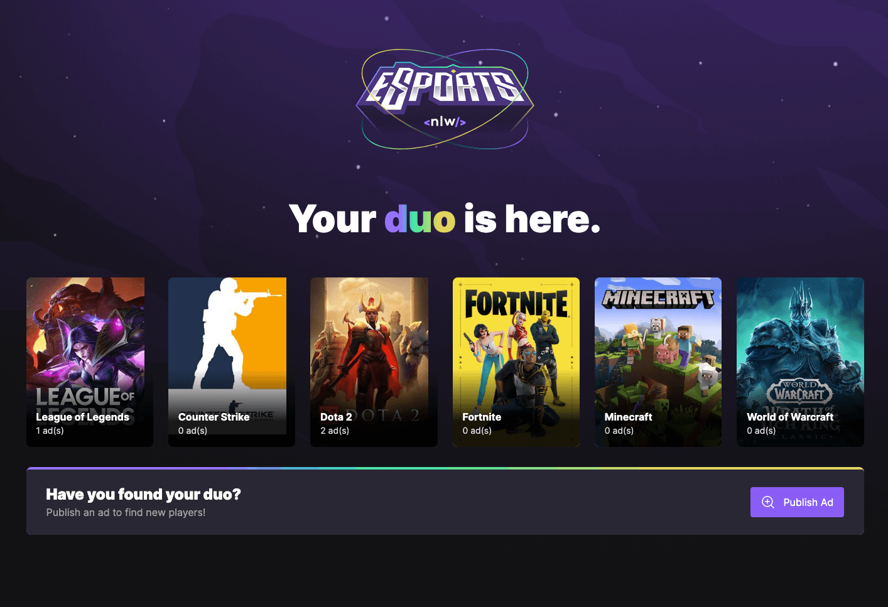
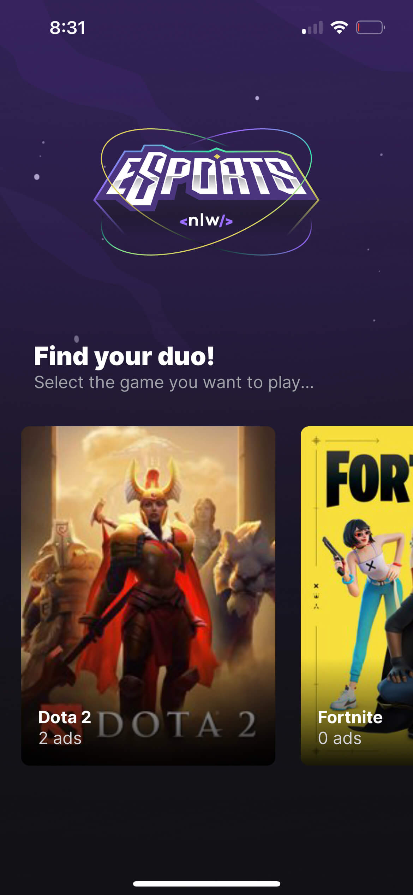
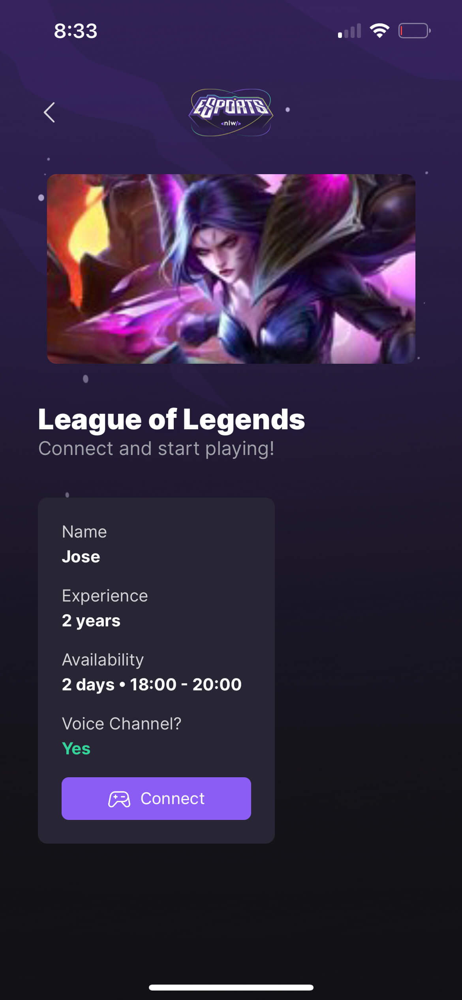
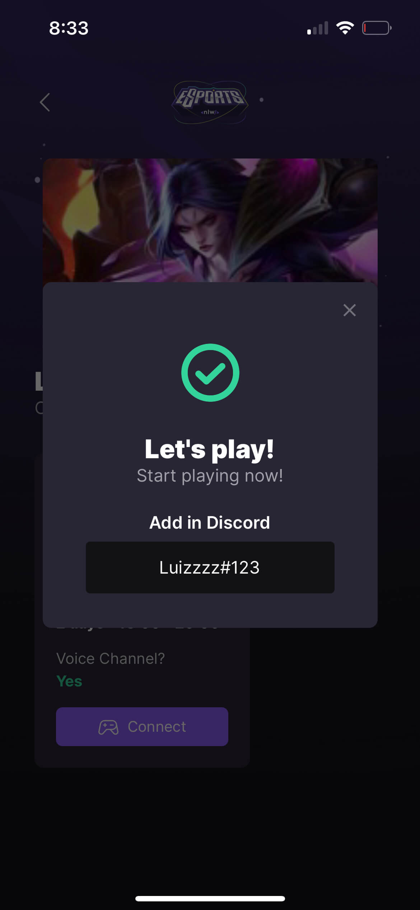

<h1 align="center">E-Sports Duo</h1>

  

 

## 🧑‍💻 Project

This project helps gamers to find their duo before joining a game session.

User can list a set of games and choose one to publish an ad for. Other players can see the published ads and choose which one to connect to.

Once chosen, their discord ids become available for each other.

 

    <strong>Web Client &nbsp; (ReactJS)</strong>

    
     

    <b>Mobile Client &nbsp; (React Native)</b>

    
    
    

 

## ✨ Technologies
This project was developed in React using the following technologies

- [Node.js + Express](https://nodejs.org/en/)
- [Prisma](https://www.prisma.io/)
- [React](https://reactjs.org/)
- [React Native](https://reactnative.dev/)

 

## 🚀 How to run:

- Clone this repository
- to start server
    - Navigate to backend folder `cd backend`
    - Run `npm install`
    - Run `npx prisma migrate dev` to create the database tables.
    - Run `npm run dev` to start the the server.
- to start webclient
    - Navigate to webclient folder `cd web-client`
    - Run `npm install`
    - Run `npm run dev`
- to start mobile client
    - Navigate to webclient folder `cd mobile-client`
    - Run `npm install`
    - Run `expo start`

All set! Both clients will communicate to the same backend.

The <strong>webclient</strong> is responsible to publish ads. 
The <strong>mobileclient</strong> is responsible to connect to an ad.
